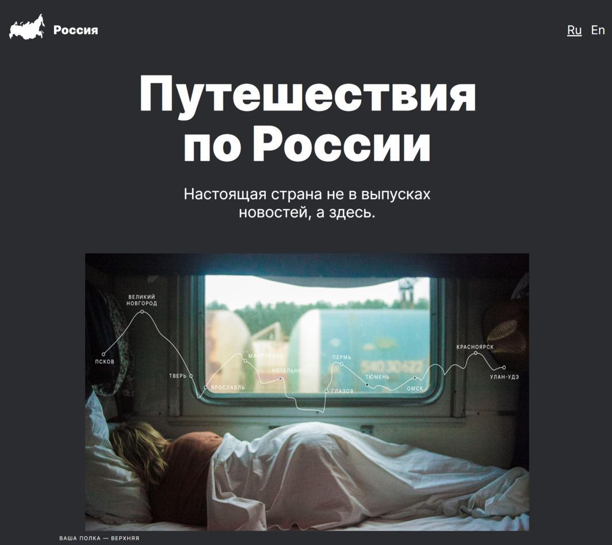
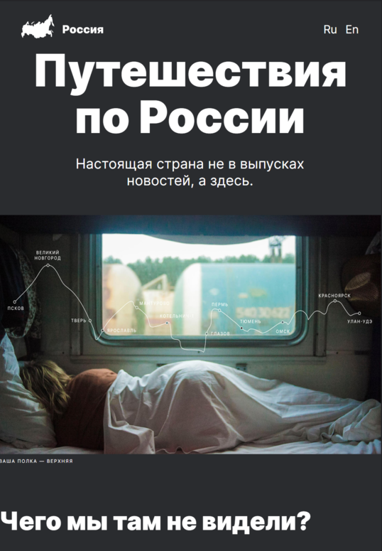
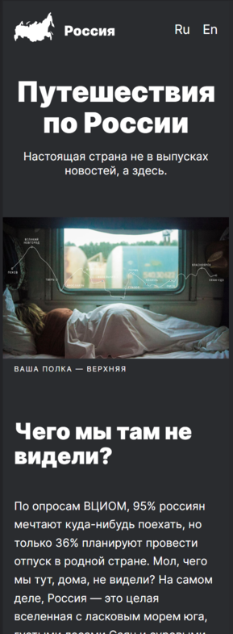

# Проект: Путешествие по России  

 

## Описание:   
Проект о путешествии по России.

Проектная работа. 

 

Одностраничный лендинг. 

**Desktop**
  

**Tablet**  
  

**Mobile**  
  

 

* Для позициониррования элементов исполльзовал flex или grid позиционирование. 

* Для анимации ссылок использовал opacity и transition. 

* [Ссылка на макет в Figma](https://www.figma.com/file/5S2WSbEFL6awjVWJ0NWL8Q/Sprint-3_-Russia-_-desktop-mobile?node-id=28503%3A0)

* [Работа на GitHub Pages](https://apostaldante.github.io/russian-travel/) 

